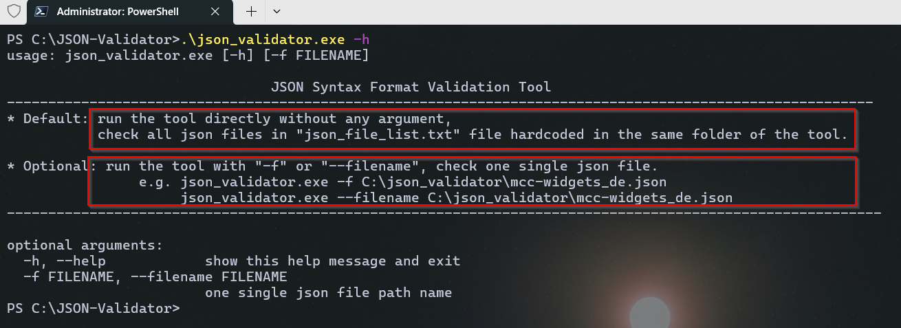
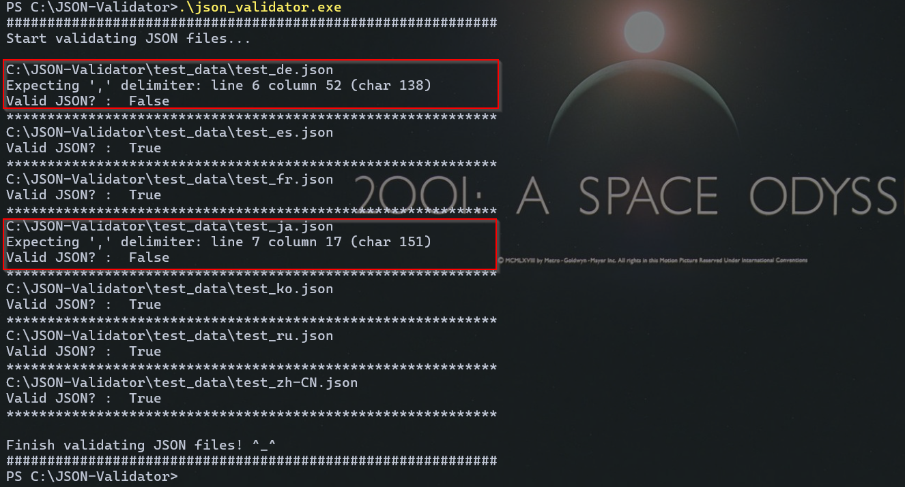
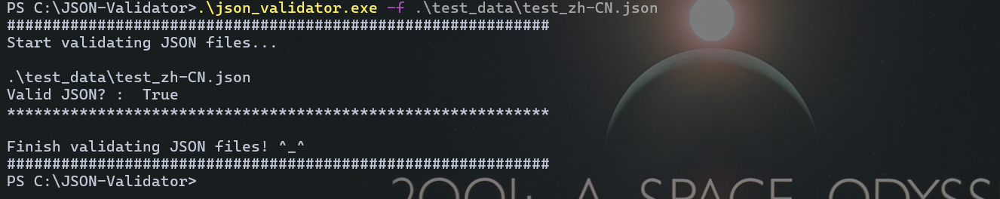
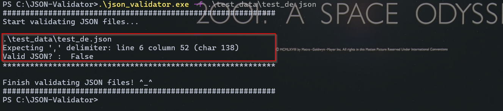

# JSON-Validator

<br>

## Problem - WHY

- Some translation JSON files broken in some cases
- Product Functional Issue caused by JSON file broken 
<br><br>
## Solution - HOW

- Common Option: online json validation tool
  - https://jsonlint.com/
  - Need copy json file content manually one by one
  - Tedious and time-consuming if many json files need check
  - After online searching, no existing local command line tool to validate JSON was found so create the new tool to resolve the issue.
  <br><br>

### My NEW Tool
**json_validator.exe**

### Usage Demo

  -- help

```
    C:\>json_validator.exe -h
```


 
  -- **batch** mode (default **json_file_list.txt**):

```
    C:\>json_validator.exe
```



  -- **single** mode

```
   C:\>json_validator.exe -f <file_path_name> 
```





## Next Step

- Any further requirement
- Get JSON file list? GUI support? Check result log support?
